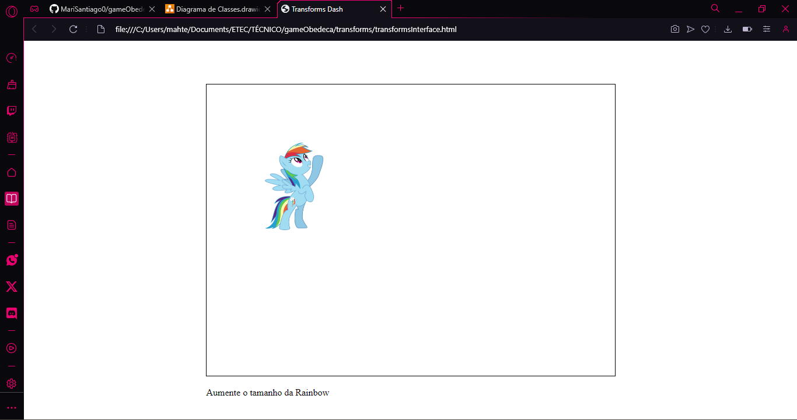
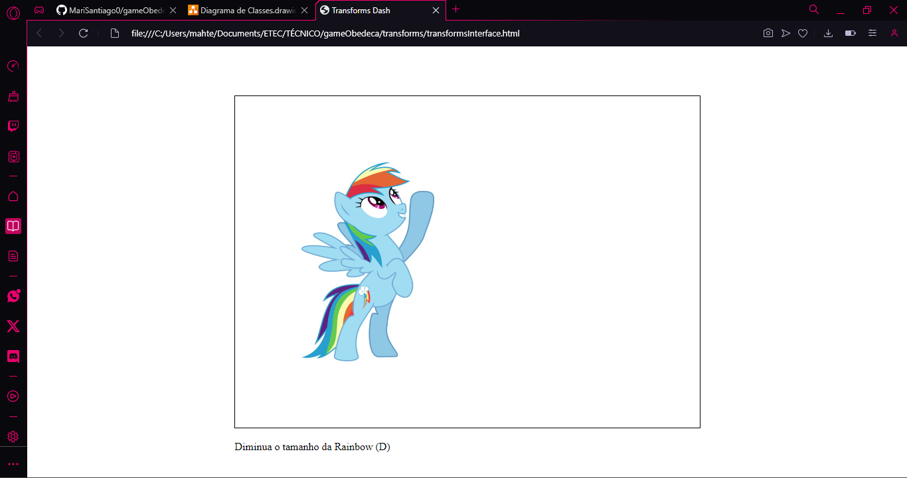
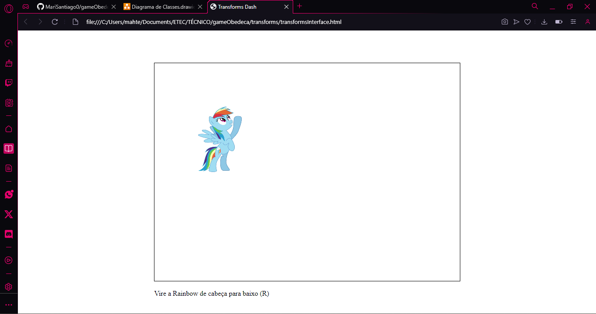
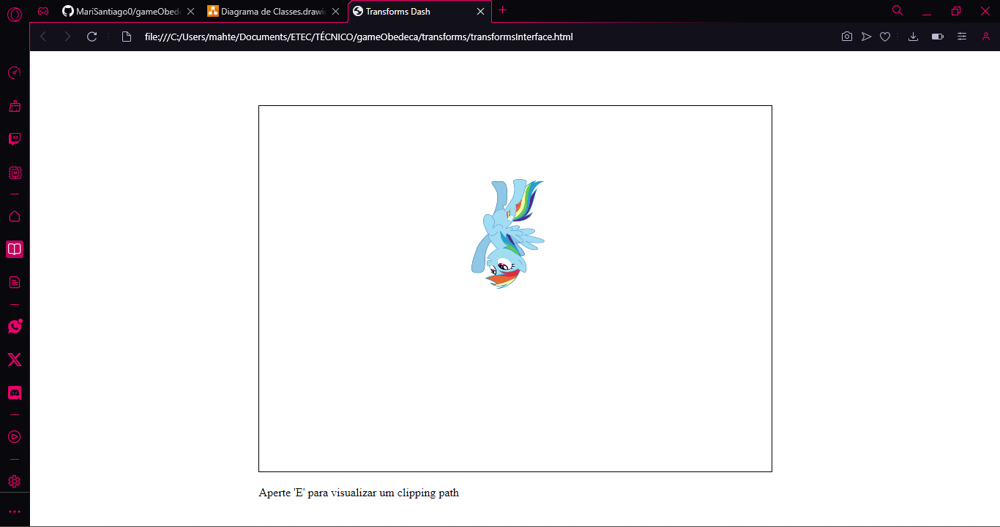

# gameObedeça - Transformações
Esse projeto é um jogo feito com Javascript que contém os seguintes conceitos:
<ul>
    <li> Transform (aumenta e diminuir imagem) </li>
    <li> Rotate (rotaciona e diminuir imagem) </li>
    <li> Move (movimenta e diminuir imagem) </li>
    <li> Clipping Path </li>
</ul>
E neste jogo, o usuário precisa seguir as intruções para que o jogo possa ser finalizado com sucesso.

## Autores
Mariana Santiago e Yuri Telis

## Desenvolvimento
Inicialmente foi feito um HTML com um CSS e um Script dentro dele para fazer uma tela de inicio com um botão para começar o jogo. Depois foi feito outro HTML para a interface do jogo, com a imagem e a parte das perguntas.
O CSS define a posição centralizada, cor e tamanho da página, das imagens e dos textos.
Por fim, no Javascript são programados os event listeners que vão movimentar, rotacionar, aumentar e diminuir a imagem.

## Código Explicado
### HTML
No HTML, os códigos básicos da head são feitos, que são a definição do tamanho de acordo com o monitor do usuário, a permissão para caracteres especiais, título e o link para o CSS. E no body, a div possui o canvas e um parágrafo onde os comandos do jogo serão mostrados e o link para o JavaScript.

### CSS
No CSS é definido o display e a posição dos conteúdos do body, assim como altura e margem e da classe container é definido altura, largura, posição e a borda.

### JavaScript
No JavaScript é feito uma função para o canvas e todo o jogo. Essa função possui a declaração de diversas constantes, lets, eventos e funções. No inicio, uma função chamada "drawCanvas" que desenha a imagem na tela junto de eventos para aplicar os conceitos citados no começo do README são feitos e definem que para mover, rotacionar, aumentar, diminuir e fazer o clipping path são usadas as teclas do computador. Uma função para exibição da mensagem de que concluiu a  pergunta com sucesso e feita assim como uma funçãoo para mudar as perguntar com condições são utilizadas para identificar qual pergunta é a pergunta feita baseado na let "perguntaAtual". Mais um evento é definido para que a mudança de perguntas seja feitas quando a atual que é respondida com as letras é executada com sucesso e outro evento é definido em seguida para a que é respondida com as setas. Por fim, um evento para reiniciar o jogo é feito.

## Execução do Jogo

## Diagrama de Classes

## Print dos Comandos

