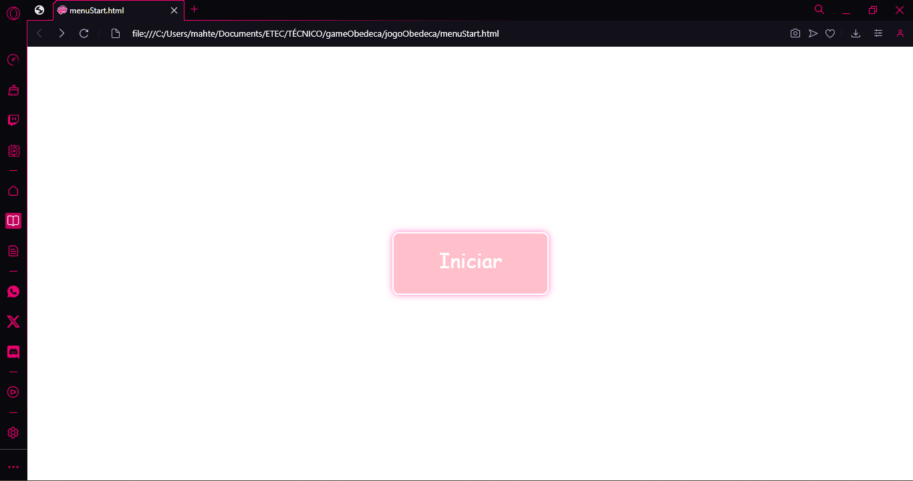
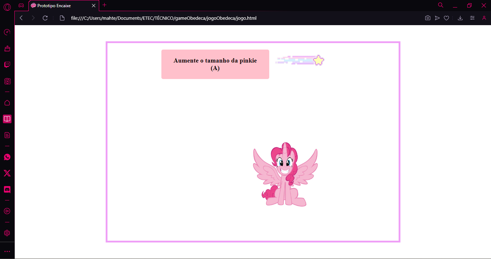
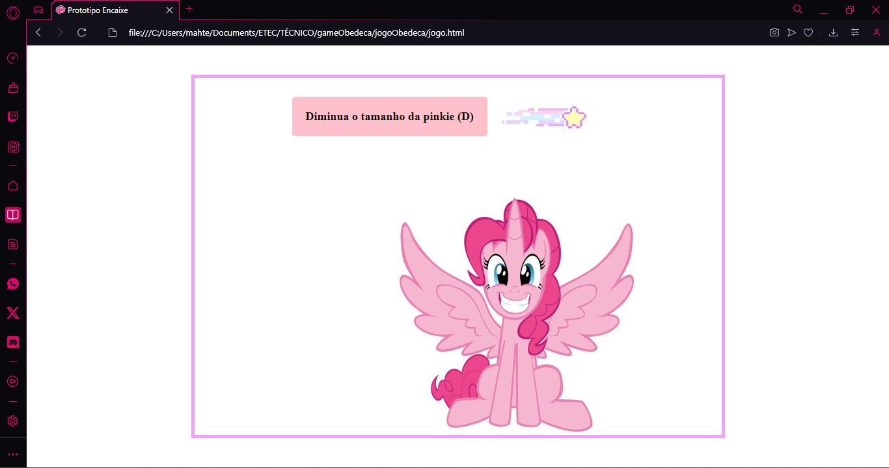
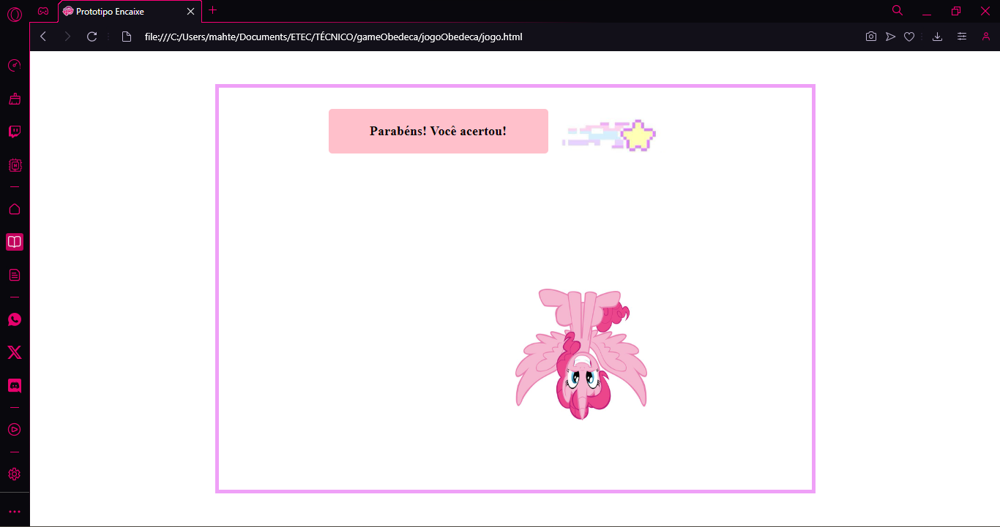
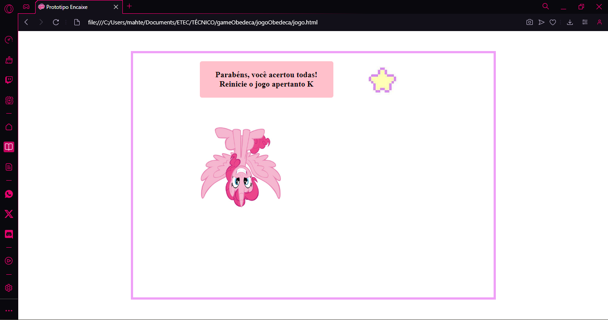
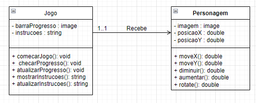
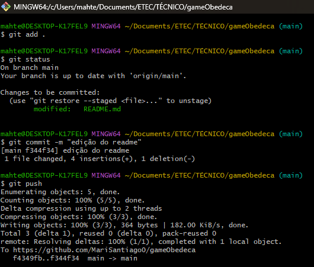

# gameObedeça
Esse é um jogo que explora os conceitos de transform, rotate e move do Javascript. No jogo, o usuário precisa seguir as instruções para que ele seja concluído.

## Autores
Mariana Santiago e Yuri Telis

## Desenvolvimento
Inicialmente foi feito um HTML com um CSS e um Script dentro dele para fazer uma tela de inicio com um botão para começar o jogo. Depois foi feito outro HTML para a interface do jogo, com a imagem e a parte das perguntas.
O CSS define a posição centralizada, cor e tamanho da página, das imagens e dos textos.
Por fim, no Javascript são programados os event listeners que vão movimentar, rotacionar, aumentar e diminuir a imagem.

## Execução do Jogo

## Diagrama de Classes

## Print dos Comandos
